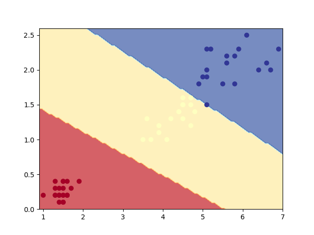
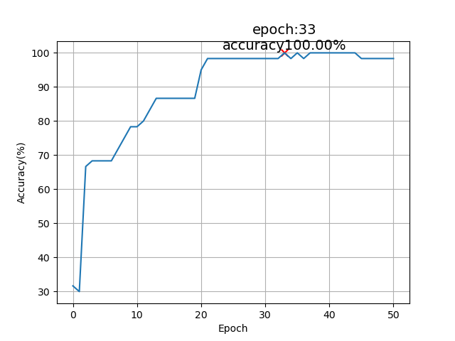

# Tiny Machine Learner 💻

本人闲来无事，文思泉涌写出来的迷你机器学习库，具有运算速度慢、运行占用内存大、精度低、泛用性差等优点 :P

## Tiny Grader

计算微分的简单办法就是用`(f(x+dx) - f(x)) / dx`来做近似，其中dx的值可以用下面的方法求取：

```python
dx = 1
while 1 < 1 + dx:
    dx /= 2
dx *= 2
```

但我们怎么可能用这种低端的办法，一点都不专业😡（~~说实话实用效果还不错~~），而且为了求一个变量的微分，你就需要让整个神经网络正向运算2次，当你的神经网络逐渐变得复杂的时候，训练速度和效果就会急剧下降。

那么怎么才能让我们的程序可以自动求解微分呢？

如果只做普通计算，那么就不需要保存计算式的“形状”，而计算微分则要保存这些信息。TinyGrader的核心就是用表达式对象来取代普通的代数式，以最简单的常数和变量为例：

```python
class Const:
    def __init__(self, v):
        self.v = v

    def value(self) -> float:
        return self.v

    def grad(self, x) -> float:
        return 0


class Number:
    def __init__(self, v: float):
        self.v = v

    def value(self) -> float:
        return self.v

    def set_value(self, v: float) -> None:
        self.v = v

    def grad(self, x) -> float:
        if x == self:
            return 1
        else:
            return 0
```

这两个就像是数据结构-树的叶子节点一样，是计算式最基本的组成单位，相应的梯度计算不作赘述。然后就是运算符的定义了，以加法为例：

```python
class Add:
    def __init__(self, a, b):
        self.a = a
        self.b = b

    def value(self) -> float:
        return self.a.value() + self.b.value()

    def grad(self, x) -> float:
        return self.a.grad(x) + self.b.grad(x)
```

有了上面三个类，你就可以构造出`x + y + 1`这样的计算式了，计算式的值以及梯度都可以自动求取：

```python
x = Number(0)
y = Number(1)
exp = Add(y, Add(x, Const(1)))
exp.grad(x)  # exp在x=0，y=1时对x的梯度
x.set_value(1)
exp.value()  # exp在x=1，y=1时的值
```

这样构造出来的表达式就像是数据结构里的二叉树一样，计算梯度和求值实际上就是在做树的遍历，了解过LISP的人可能会感到非常亲切。

类似的我定义了减、乘、除、乘方、e指数等运算符，以及Sigmoid、Tanh这些经典的激活函数，这些东西构成了TinyGrader的所有内容。

### 问题

这样构造的表达式虽然能进行自动微分，但是性能肯定是很差的，一个很明显的问题就是会做大量的重复计算。

比方说f是关于g的函数，而g是关于x和y的函数，我们在求取f对于x和y的偏微分时，就需要用到链式法则：

df/dx = df/dg * dg/dx

df/dy = df/dg * dg/dy

注意到了吗？df/dg在求取df/dx时就已经计算过一次了，而在求取df/dy时又被计算了一次，像这样的重复计算在更新神经网络的权重时会极大地拖累程序的性能。

这个问题该如何优化？我觉得可以参考 SICP 那个关于斐波那契数列递归程序优化的例子，让我们的程序在求取多个参数的微分时可以利用到已经计算出来的结果。

## Tiny Learner

这个文件里主要是矩阵有关的函数以及优化算法。

矩阵部分无需多言，一个是创建随机矩阵的函数，另一个是进行矩阵运算的函数。文件里描述的矩阵就是一个二维的Python列表，矩阵乘法也无非是简单的嵌套循环而已。

优化算法里有普通的梯度下降优化器、动量梯度下降优化器、RMS梯度下降优化器和Adam优化器。后面三个和普通的梯度下降算法不同的地方就是参考了以前的梯度值，以此来调节参数更新的速度。

## Application

我在经典的石蕊数据集做了测试，分类效果还不错：





对石蕊数据集的测试有三个文件：

- iris-binary.py: 删除了一个石蕊种类，用于测试二分类
- iris-partial.py: 只用了两个特征进行多分类测试，便于画图
- iris-full.py：用了全部四个特征，多分类测试

## More

造轮子其实是个有趣的过程，在做这个东西的过程中，我体会到了面向对象的不足、LISP
语法的强大等等东西，这些都是我当脚本小子所感受不到的，如果我的拙作对你有所帮助，那么我很荣幸;)
