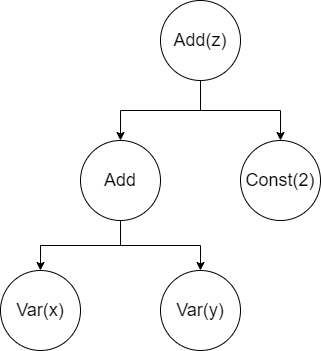
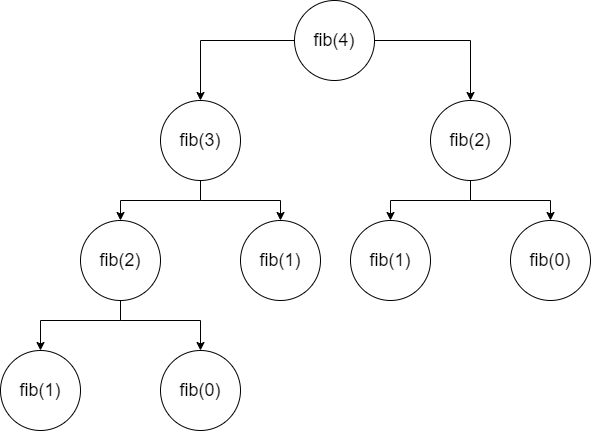

# Tiny Machine Learner 💻

本人闲来无事，文思泉涌写出来的迷你机器学习库，具有运算速度慢、运行占用内存大、精度低、泛用性差等优点 :P

## Tiny Grader

想要从头实现一个神经网络，就得先解决自动微分的问题，其中最简单的办法就是用有限差分做近似：

```python
eps = 1
while 1 < 1 + eps:
    eps /= 2
eps *= 2

def d(f, x):
    return (f(x + eps) - f(x)) / eps
```

不过这样做有两个缺点，一是它的精度比较低，二就是效率差，每求一次误差对于权重的梯度都要进行两次完整的正向运算。

要想进行真正意义上的自动微分，我们就得保持一个计算式的结构，而普通的Python程序是没办法得到有关计算式结构的信息的，你唯一能做的就是用它作正向计算。

为此，我们需要撇弃普通的计算式，从最基本的常数和变量开始，重新构建一个具有结构的表达式：

```python
class Const:
    def __init__(self, v: float):
        self.v = v
    def value(self) -> float:
        return self.v
    def grad(self, x) -> float:
        return 0

class Var:
    def __init__(self, v: float):
        self.v = v
    def value(self) -> float:
        return self.v
    def set_value(self, v: float) -> None:
        self.v = v
    def grad(self, x) -> float:
        return 1 if x == self else 0
```

我们首先传入一个数值作为常数和变量的值，这个值可以用value方法获取，区别是变量的值是可以通过set_value变动的，常数和变量的微分很好说，常数的导恒等于0，而变量的微分则要看是不是它自己，如果是，那么就返回1；如果不是，则按常数处理。

我们接着定义一个最基本的运算-加法：

```python
class Add:
    def __init__(self, a, b):
        self.a = a
        self.b = b
    def value(self) -> float:
        return self.a.value() + self.b.value()
    def grad(self, x) -> float:
        return self.a.grad(x) + self.b.grad(x)
```

加法对象的值等于两个加数的和，微分等于两个加数的微分之和，有了这三样东西，我们就可以构建出最基本的有结构计算式，并且能够自动求值和微分：

```python
x = Var(1)
y = Var(2)
z = Add(Add(x, Const(2)), y) # z = (x + 2) + y
z.grad(x) # z在x=1,y=2处对于x的偏导
x.set_value(2)
z.value() # z在x=2,y=2处的值
```

我们构建出来的计算式很像是数据结构中的二叉树，常量和变量就像叶子节点：



学过Lisp语言的人可能会非常亲切，毕竟Lisp的语句本身就是自带这种结构的。

仿照着上面的例子，逐步定义出减法、乘法、平方、绝对值的对象，我们就可以得到一个完善的自动微分库，不过这样的程序在神经网络中会遇到大麻烦，在讲述这个问题之前，我们先来看一个例子：

```python
def fib1(n):
    if n == 0 or n == 1:
        return n
    else:
        return fib1(n-1) + fib1(n-2)


def fib2(n):
    def helper(n1, n2, n):
        if n == 0:
            return n1
        else:
            return helper(n2, n1+n2, n-1)
    return helper(0, 1, n)
```

这是两段经典的斐波那契数列的递归程序，fib1和fib2产出相同的结果，但是fib1的效率要比fib2差很多，首先fib1做了大量的重复计算：



不难看出，在计算fib(4)的值时，fib(2)被计算了两次，像这样的重复计算在n增大时会不断增多，拖累整个程序的效率。

我们上面定义的结构化的计算式也是一样，我们在更新神经网络的权重时，每一次计算梯度都要对整个神经网络进行一次反向运算来得到误差函数对某一个权重的梯度，尽管一些中间值已经被计算过了，简单来说就像这样：

df/dx = df/dg * dg/dx

df/dy = df/dg * dg/dy

尽管df/dg在求取df/dx时已经计算出来，并且值没有发生变化，但是我们在求取df/dy仍然需要重新计算该值，当我们的神经网络层数和神经元数量增加时，这样的重复计算量是大到可怕的，所以我们必须改造我们的程序，让它像fib2那样高效。

TODO: 说明待补充，详细程序请见Alpha文件夹 ...

## Tiny Learner

这个文件里主要是矩阵有关的函数以及优化算法。

矩阵部分无需多言，一个是创建随机矩阵的函数，另一个是进行矩阵运算的函数。文件里描述的矩阵就是一个二维的Python列表，矩阵乘法也无非是简单的嵌套循环而已。

优化算法里有普通的梯度下降优化器、动量梯度下降优化器、RMS梯度下降优化器和Adam优化器。后面三个和普通的梯度下降算法不同的地方就是参考了以前的梯度值，以此来调节参数更新的速度。
